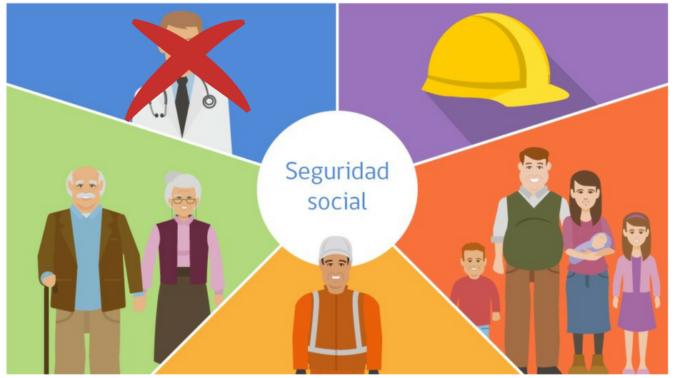

<!DOCTYPE html>
<html lang="es">
<head>
    <meta charset="UTF-8">
    <meta name="viewport" content="width=device-width, initial-scale=1.0">
    <title>Guía sobre la Seguridad Social en España</title>
</head>
<body>
    <header>
        <h1>Guía Práctica sobre la Seguridad Social en España</h1>
    </header>
    <nav>
        <a href="SeguridadSocial.html">Inicio</a>
        <a href="regimenes.html">Regímenes de la Seguridad Social</a>
        <a href="afiliacion.html">Afiliación, Altas y Bajas</a>
        <a href="cotizacion.html">Cotización y Recaudación</a>
        <a href="prestaciones.html">Prestaciones de la Seguridad Social</a>
        <a href="desempleo.html">Prestaciones por Desempleo</a>
        <a href="subsidios.html">Subsidios y Ayudas</a>
        <a href="derechos.html">Derechos y Obligaciones</a>
    </nav>
    

        <section id="concepto">
            <h2>¿Qué es la Seguridad Social?</h2>
            
La Seguridad Social es un pilar fundamental del Estado del Bienestar en España. Su finalidad es garantizar protección económica y sanitaria a los ciudadanos en situaciones de necesidad, como enfermedad, accidente, jubilación, viudedad, orfandad o desempleo.

            
El derecho a la Seguridad Social está recogido en el artículo 41 de la Constitución Española de 1978, que obliga a los poderes públicos a mantener un sistema de protección adecuado. Sin embargo, para acceder a estas prestaciones, es necesario cumplir ciertos requisitos, especialmente estar afiliado y haber cotizado un tiempo mínimo.

            
            
Existen dos niveles de protección: 

            <ul>
                <li><strong>·Contributivo: </strong> Para quienes han cotizado lo suficiente.</li>
                <li><strong>·No Contributivo: </strong> Para quienes no han cotizado lo suficiente y carecen de recursos.</li>
            </ul>
            

             
            <h3>Principio de Solidaridad:</h3>
            
El sistema de Seguridad Social se basa en la solidaridad entre los ciudadanos, de forma que aquellos con mayor capacidad económica contribuyen más para ayudar a quienes se encuentran en situación de necesidad.

            <h4>Estructura de la Seguridad Social</h4>
            <ul>
                <li><strong>Régimen General: </strong> Incluye a la mayoría de los trabajadores por cuenta ajena.</li>
                <li><strong>Regímenes Especiales: </strong> Autónomos, trabajadores agrarios, del mar, minería, funcionarios y estudiantes menores de 28 años.</li>
            </ul>
            
Los empleados de hogar y los trabajadores agrícolas por cuenta ajena han sido incorporados al Régimen General.

        </section>
    

    <footer>
        
© 2024 Seguridad Social en España. Información basada en fuentes oficiales.

    </footer>
</body>
</html>
